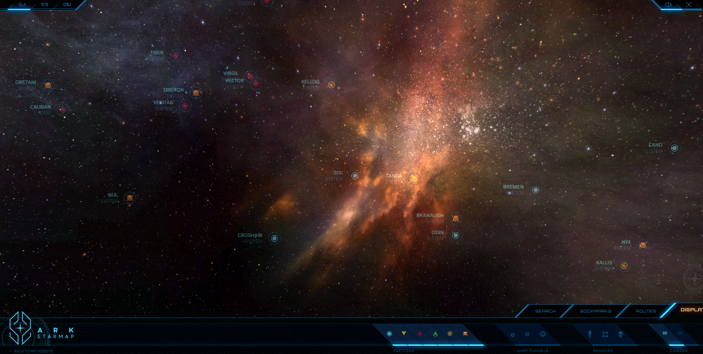
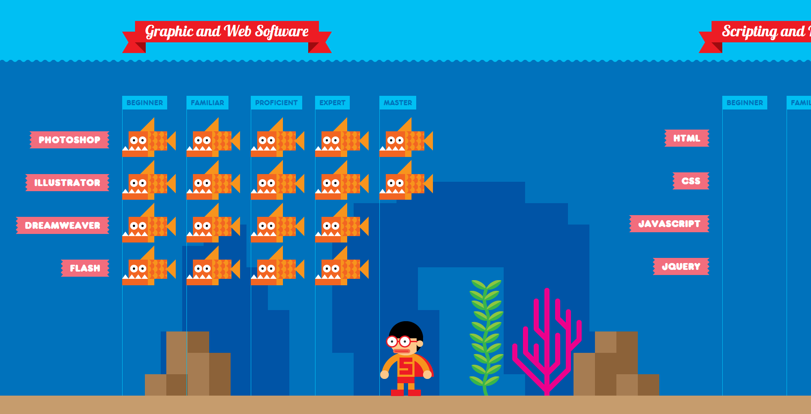
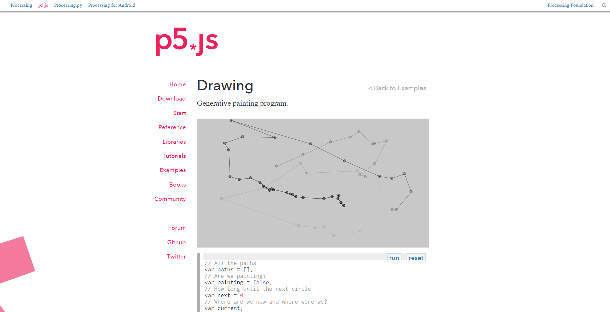
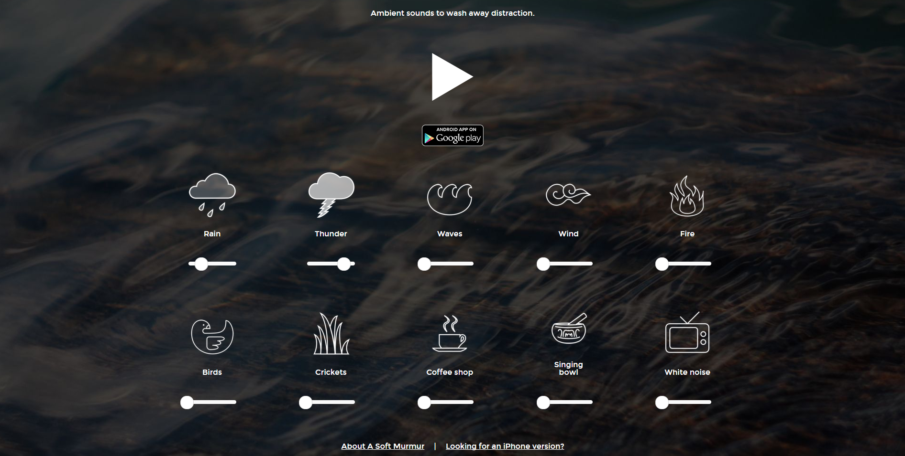
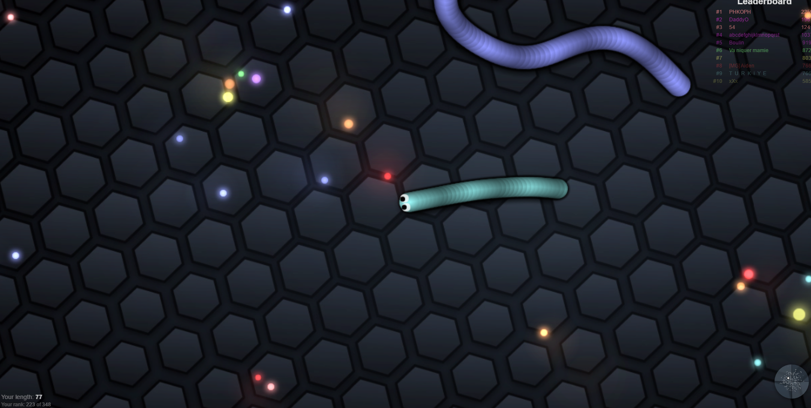
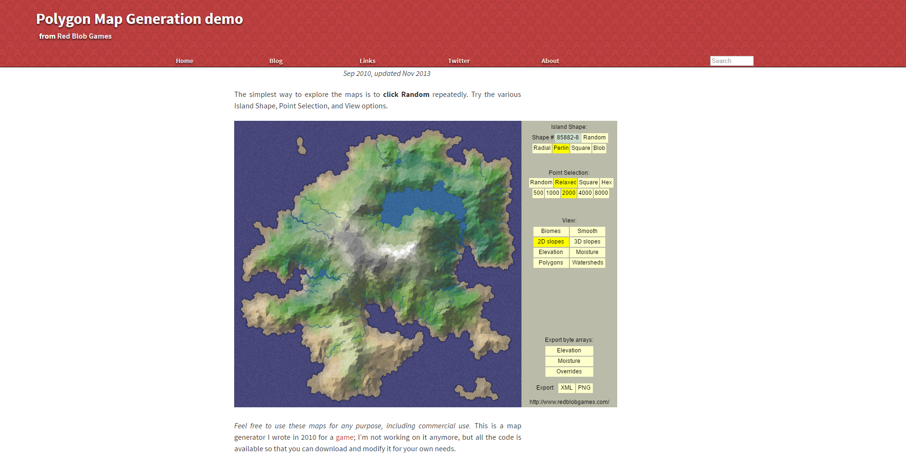
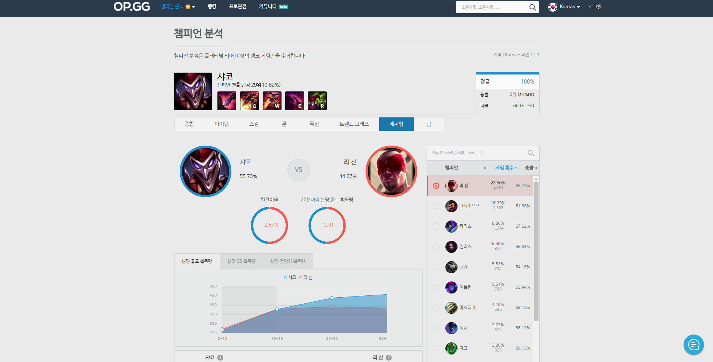
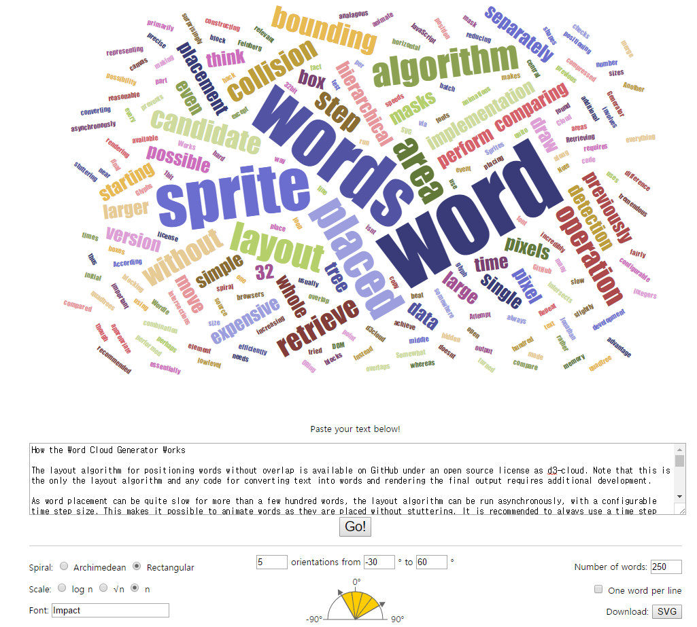

## 우주 여행 웹게임
https://robertsspaceindustries.com/starmap  
우주를 탐험하는 느낌을 주는데 이런 상호작용 할 수 있는 3D기술이 웹으로 구현되었다는 것이 경이롭습니다.  
  

## 지구 기상상황
https://earth.nullschool.net/  
입자의 흐름으로 표현되는 바람들이 유동적으로 움직이며 그려내는 모습은 마치 제가 범우주적 관찰자가 된 기분을 들게합니다.  
  

## 인터렉티브 이력서
http://www.rleonardi.com/interactive-resume/  
틀에박힌 이력서들과는 다르게 정말 자신을 잘 표현하는 이력서라 귀감이 됩니다.  
  

## 해커가 된 기분이 나는 사이트
http://hackertyper.net/  
어떤 키를 입력하든 매트릭스의 네오가 된 기분을 느낄 수 있어 재밌습니다.  
  

## p5.js 사이트
http://p5js.org/examples/hello-p5-drawing.html  
다양한 인터렉티브한 예제들이 모여져 있고 이를 수정가능한 코드로 제공해 사용자가 이것저것 바꿔가며 놀 수 있게 해두어 재밌습니다.  
  

## 비트박스 사이트
http://www.beatboxacademy.ca/  
비트박스를 재현할 수 있는 점이 흥미로운데 특히 아래로 스크롤 할 경우 나타나는 애니메이션들이 특이합니다.  
  

## 백색소음 사이트
http://asoftmurmur.com/  
다양한 자연의 소리, 백색 소음들을 조합해 저에게 가장 맞는 배경음을 만들어 낼 수 있어 좋습니다.  
  

## 스네이크 게임 사이트
http://slither.io/  
실시간 네트워크 게임인데 이를 HTTP 1.1을 근간으로 하기 때문에 요청에 대한 응답 시간이 긴 웹 상에서 구현했다는게 신기합니다.  
  

## 섬 생성 사이트
http://www-cs-students.stanford.edu/~amitp/game-programming/polygon-map-generation/demo.html  
듀랑고라는 모바일 게임을 만든 팀에서 자동으로 섬을 생성하는 알고리즘을 제작하기 위해 참고한 페이지였는데 다양한 옵션으로 그럴듯한 섬을 만들어 내는 부분이 재밌습니다.  
  

## 게임 내 영웅 분석 사이트
https://www.op.gg/champion/statistics  
롤이라는 게임을 만든 회사에서 제공하는 API들을 통해 데이터를 가공하고 분석하여 그래픽적으로 표현한 부분이 참신합니다. 보통 데이터는 정보가 되기 어려운데 이를 잘 살려냈습니다.  
  

## 워드클라우드 생성 사이트
https://www.jasondavies.com/wordcloud/  
비트박스 사이트가 중복이라 하나 더 추가합니다. 소설의 내용을 집어넣든 헌법조문을 집어넣든 적절한 옵션을 통해 그럴듯한 워드클라우드 이미지를 생성해 낼 수 있어 흥미롭습니다.  
 
