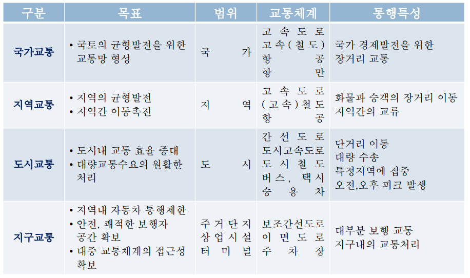

# 중간고사 대비 정리

## 교통
정의 : 한 지역에서 다른 지역으로의 사람과 물자의 이동

### 교통의 4요소 : 중요
- infrastructure : 길 철도 항로
- vehicles : 차량 열차
- operations : signal, 운영
- human

### Trip과 Activity
Trip은 목적을 하기 위한 수단
Activity는 목적적

### 교통의 기능
**사람 혹은 상품의 수송**
intra가 붙은건 그 안에서
inter가 붙은건 밖에서 밖으로

### 도시교통과 지역교통 : 시험
Urban transport : 단거리, 출퇴근, mass(대용량), peak-travel(쏠림현상)
Regional transport : 더 큰 범위, 장거리, 출장, 여행

### region에 따른 분류 : 시험
대부분 공간으로 구분함

### mode에 따른 분류
개인교통수단
대중교통수단 : 정해진 경로, 타임 스케쥴
준대중교통수단 : 택시
화물교통수단 : 장거리-철도, 단거리-화물차

## 미래의 교통
고령화, 기후변화, ICT, 유가, 에너지
공유경제

## 수요와 공급
수요의 특징 : 정성적, 세분화, 파생된 수요, 공간적
공급의 특징 : 서비스, 건설-운영 주체 분리, 크고 긴시간, 정치적적

## 모순
**triple convergence**
- spatial : 원래 도로 -> 새 도로 -> 새 도로가 더 막힘
- temporal : 새 도로가 시간대 별로 다막힘
- modal : 차 안쓰던 사람 -> 어 잘 뚫리네 하고 끌고나옴

## 교통 계획
목적 : 비용절감을 통한 생산성 향상
mobility 이동성 : 고속도로, accessibility 접근성 : 이면도로

### 종류
시간 기준으로 분류함
- 단기 1-2년 : 다수 상이 대안, 서비스지향, 소자본
- 중기 3-5년
- 장기 10-20년 : 소수 비슷 대안, 시설지향, 자본집약

## 예측 모델 : 중요
트립 발생 -> 트립 분배 -> 수단 선택 -> assignment

## TAZ
교통 존, traffic analysis zone

## 2주차 : 교통 수요 예측
제품의 가격 중 상당부분이 운송비
교통 수요의 단위는 **Trip**
**OD(Origin/Destination)**

### HB v.s. NHB : 중요
홈 베이스드 트립 : 출발/도착지가 집이면 해당
집 -> 학교 -> 도서관 -> 식당 -> 집 에서
HB는 2번, NHB도 2번번

### Trip Unit
- person 사람수
- vehicle : person / 제차 인원(차에 탄 사람 수)
- PCU : 버스는 *2, 트럭은 *3 처럼 가중치 주는거

### Linked v.s. Unlinked trip : 중요
Linked trip : 목적 통행, 수단으로 뭉뚱그리기
Unlinked : 수단 통행, 숫자가 더 큼

### Trip end, chain
Trip chain : 하나의 목적에 통행이 연결된 거 - 버스타고 환승해서 지하철 탄걸 하나로 보는거
Trip end : 장소의 수
Trip chain : 집, 회사 해서 2개
Tour : 서클의 개수

## TAZ - 교통분석존
센트로이드, 센트로이드 커넥터

## Network
network = node + link
node는 교차로, 정류장, 역

**꼭 기억해야할 4가지**
- 코돈 라인 : 경계
- 스크린 라인 : 격자형인 가상의 직선선
- spider network : 센트로이드끼리 연결한거
- desire line : 희망선, 이동의 양을 굵기로

## 교통 수요 예측
기준년도(Base year)는 보통 전년도, 미래(Future year)는 20년 뒤
**인구 예측**이 가장 기본본

### 간단한 방법
#### 과거추세연장법 : Trend analysis
과거의 자료가 없으면 못함, 수요 예측의 검증용으로 쓰임
직선이든 S든 커브든 하나의 선으로 표현 함

### 수요탄력성 : Elasticity-based Models
가격에 대한 수요의 탄력성
e가 + 면 가격이 올라가면 수요과 올라가는 관계
1보다 크면 탄력적 (x가 1증가할 때 y는 1이상 증가)
1보다 작으면 비탄력적, 1이면 단위 탄력적적
e = (delta D/D0)/(delta P/P0) : 호탄력성
e = (round D/D0)/(round P/P0) : 점탄력성

#### 직접탄력성 vs 교차탄력성
직접탄력성 : 직접, 택시가격이 오르면 택시수요가 내려감
교차탄력성 : 간접, 택시가격이 오르면 버스수요가 올라감

#### 이슈 3가지 : 중요
- aggregation bias : 집계적 오차
- 하나의 변수만 집중하고 다른건 무시하는거
- 직선식이 되는거

## Survey
시간에 따라
- 크로스 섹셔널
- Longitudinal
- repeat 크로스 섹셔널
- 패널 조사 : 동일한 사람 계속
- 타임 시리즈 : 집계적 조사, 인구, 자동차수

설문지의 첫 페이지는 반드시 **목적**

SP : 주관식, RP : 객관식

### Sampling Method
비확률적 <-> 확률적(더 랜덤, bias적음)

#### 비확률적
- convenience : 조사자의 편의 위주로
- judgemental : 조사자의 주관적으로
- snowball : 내가 조원들, 조원들이 각자 동아리

#### 확률적
- simple
- stratified : 스트라타, 계층나누기
- 클러스터 : 조각들의 성격이 비슷비슷해야함
- Endogenous : 내 앞에서 7번째로 지나가는 사람

### 샘플 사이즈
정확성과 정밀함
Z score는 1.96, 2.56
p는 잘 모르니까 임의로 0.5
d는 목표 오차 : 0.01(오차 1%)

## 통행 발생
Origin sum : 모든 나가는 양, 매트릭스 가로의 합
Destination sum : 도착의 합, PA로 따졌을때 어트랙션

OD와 PA의 차이는 집이 P가 된다는 거

발생량에 영향을 주는거 : 수득, 차, HH, 땅값, 접근성
도착량에 영향을 주는거 : 종사자수, 학생수

### 모델들
- 성장인자법
- 원단위
 - 단순원단위
 - 교차분류법
 - 다중교차분류법
- 회귀분석

#### 성장인자법
F는 Pd/Pc(미래인구/현재인구, 미래차량/현재차량) 이런식으로 구함
인구가 2배 늘었다고 통행이 2배 늘어나진 않음
external trip에 주로 쓰임

#### 원단위법
F는 현재통행량/현재지표
미래 트립 = F * 미래지표
zonequf vusck antl

#### 교차분류분석
알고있음

#### MCA
평균을 가지고 추정하는거
각 행렬의 d는 전체T에서 각행렬의 평균을 뺀거
그리고 각 셀은 전체T + d1 + d2

#### 회귀분석
알고있음
t값이 크면 리젝트 -> 좋은거임
R제곱은 (긴거 - 요소에서 추정선)/긴거 = ssr/sst
긴거 : SST
요소에서 추정선 : SSE
추정선에서 평균 : SSR